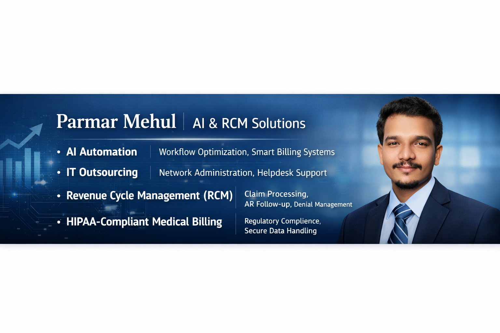

  

<h1 align="center">Parmar Mehul 👋</h1>
<h3 align="center">He/Him | AI & RCM Solutions | Business Development Executive</h3>

  

  
  
  
  
  

  
  
  

---

## 🎯 Who I Am & Who I Help

I'm a **multi-disciplinary professional** with **15+ years of experience** blending **healthcare RCM**, **IT outsourcing**, **AI automation**, **business marketing**, **productivity coaching**, **no-code development**, and **personal counseling** — helping people and businesses grow holistically.

I partner with **USA-based healthcare organizations** — from **solo physician practices** to **multi-specialty groups**, **billing companies**, and **IT-dependent clinics** — to fix what's broken in their revenue cycle, automate workflows, and unlock hidden cash flow.

Beyond business, I also work with **individuals** — students, professionals, and entrepreneurs — as a **Career & Life Problem Counselor**, guiding them through real-life challenges, career pivots, and personal growth.

Whether you're a **practice owner**, **practice manager**, **billing manager**, **RCM director**, **startup founder**, or an **individual seeking direction**, I bring clarity, strategy, and results.

- 💰 **Recover lost revenue** stuck in denials and aging A/R
- 📉 **Stop revenue leakage** before it hits your bottom line
- ⚙️ **Automate manual workflows** using modern AI & no-code tools
- 🖥️ **Outsource IT operations** with reliable, secure support
- 📣 **Market your business** with proven growth strategies
- 🧠 **Boost personal & team productivity** with systems that stick
- 🎓 **Counsel on career & life problems** with empathy and experience
- 🔒 **Stay HIPAA-compliant** with secure data handling

---

## 💼 About Me

With over **15 years of professional experience**, I currently serve as a **Business Development Executive** in the **medical billing, IT outsourcing, and revenue cycle management** industry. My focus lies in partnering with **US healthcare organizations** and **solo physician practices** to analyze revenue cycle challenges and implement tailored, impactful solutions.

Alongside my core RCM work, I've built deep expertise across multiple disciplines:

- 🧭 **Career & Life Problem Counselor** — mentoring students, professionals & entrepreneurs through real-world challenges
- 📣 **Business Marketing Expert** — go-to-market strategy, branding, lead generation & growth hacking
- ⚡ **Productivity Expert** — systems, workflows & habits for peak personal & team performance
- 🧩 **No-Code Developer** — building apps, automations & internal tools without writing code
- 🤖 **AI Enthusiast** — exploring, applying & teaching AI across business & life

My toolkit combines **deep RCM expertise**, **IT outsourcing capabilities**, **modern AI automation**, and **no-code development** — giving providers and individuals a competitive edge where every dollar and every minute counts.

- 📍 **Location:** Greater Ahmedabad Area (Serving USA Providers & Global Clients)
- 💼 **Current Focus:** AI Automation, No-Code Development & Workflow Optimization
- 🌐 **Time Zone Overlap:** Full coverage for EST, CST, MST & PST
- 🤝 **Open to:** Consulting, Partnerships, Provider Onboarding & 1:1 Counseling

---

## 🧠 Knowledge Base — What I Teach & Share

I believe in **knowledge sharing** — here are core concepts I help clients master across every domain I work in.

### 📚 On Revenue Cycle Management
> **The 5 Pillars of a Healthy RCM:** Eligibility → Coding → Claim Submission → Denial Management → A/R Follow-up. Break any pillar, and revenue leaks.

> **First-Pass Resolution (FPR) is King:** Every 1% improvement in FPR can boost collections by 2-3%. Fix the front-end before chasing the back-end.

> **Denials Are Data, Not Defeats:** Track denial reasons by payer, CPT & provider — patterns reveal exactly where to fix workflows.

### 🤖 On AI Automation
> **Automate the Boring, Humanize the Important:** Let AI handle data entry, follow-ups & reports — so your team focuses on patient care & payer relationships.

> **Start Small, Scale Smart:** Automate one painful workflow first (e.g., claim status checks). Win fast, then expand.

> **AI Won't Replace You — But It Will Replace Your Manual Tasks:** The goal isn't less staff, it's higher-value staff.

### 🧩 On No-Code Development
> **Speed Beats Perfection:** A no-code MVP in 2 weeks teaches you more than 6 months of planning.

> **The Best Stack Is the One You'll Actually Use:** Bubble + Airtable + Make.com can replace 80% of custom dev needs for small teams.

> **Automate the Bridge, Not the Whole Building:** No-code connects your existing tools — it doesn't need to replace them all.

### 📣 On Business Marketing
> **Positioning > Promotion:** A clear position sells itself. Confused positioning needs endless ads.

> **The 3-Layer Funnel:** Attract (content/ads) → Convert (offer/landing) → Retain (email/community). Most businesses only build the middle.

> **Cold Outreach Still Works — When Personalized:** 50 hyper-relevant messages beat 5,000 generic blasts.

### ⚡ On Productivity
> **Systems > Willpower:** You don't need more motivation — you need better defaults.

> **Time-Block + Energy-Match:** Do deep work when your energy peaks. Admin when it dips.

> **The 2-Minute Rule & The 2-Hour Rule:** If it takes <2 min, do it now. If it takes >2 hours, schedule it.

### 🧭 On Career & Life Counseling
> **Clarity Comes From Action, Not Thinking:** You can't think your way to a career — you have to test, learn, adjust.

> **Every Problem Has 3 Layers:** The surface (what happened), the story (what you tell yourself), the system (what keeps it happening). Fix the system.

> **Your Network Is Your Net Worth — But Only If It's Real:** Build relationships before you need them.

---

## 🛠️ Services I Offer

### 🤖 1. AI Automation
**Workflow Optimization • Smart Billing Systems**

- AI-powered claim scrubbing & error detection
- Automated denial appeals & follow-up workflows
- Intelligent document processing (EOBs, referrals, claims)
- Predictive analytics for revenue forecasting
- Chatbot & virtual assistant setup for patient communication
- Custom AI workflows using Zapier, Make.com, n8n & Power Automate

### 🖥️ 2. IT Outsourcing
**Network Administration • Helpdesk Support**

- 24/7 remote IT helpdesk for healthcare practices
- Network setup, monitoring & security management
- EHR/EMR system installation & troubleshooting
- Data backup, disaster recovery & cybersecurity
- Hardware/software procurement & lifecycle management
- Cloud migration & Microsoft 365 administration

### 💵 3. Revenue Cycle Management (RCM)
**Claim Processing • AR Follow-up • Denial Management**

- End-to-end medical billing & claim submission
- Real-time eligibility verification & prior authorization
- Charge entry, payment posting & reconciliation
- Aggressive A/R follow-up (30/60/90/120+ days)
- Denial analysis, appeals & root-cause resolution
- Payer contract review & underpayment recovery
- Custom KPI dashboards & revenue reporting

### 🔒 4. HIPAA-Compliant Medical Billing
**Regulatory Compliance • Secure Data Handling**

- Full HIPAA compliance for all billing operations
- Secure PHI handling & encrypted data transmission
- Business Associate Agreements (BAA) execution
- Regular compliance audits & staff training
- Risk assessment & breach prevention protocols
- Adherence to CMS, OIG & payer-specific guidelines

### 🧩 5. No-Code Development
**Build Apps, Automations & Internal Tools — Without Code**

- Custom web apps using Bubble, Glide, Softr & Adalo
- Internal dashboards & CRMs with Airtable & Notion
- Automated workflows with Zapier, Make.com & n8n
- Landing pages & funnels with Webflow, Framer & Carrd
- Chatbots & AI assistants with Voiceflow & Chatbase
- Rapid MVPs for startups & internal tools for teams

### 📣 6. Business Marketing
**Strategy • Branding • Lead Generation • Growth**

- Go-to-market (GTM) strategy for new products & services
- Pricing strategy & competitive positioning
- Cold calling scripts, email outreach & LinkedIn campaigns
- Content marketing & social media growth
- Funnel building & conversion rate optimization (CRO)
- Paid ads (Google, Meta, LinkedIn) & retargeting

### ⚡ 7. Productivity Coaching
**Systems • Habits • Time Mastery**

- Personal productivity systems (GTD, PARA, Time-blocking)
- Team workflows & SOP creation
- Task & project management setup (Notion, ClickUp, Asana)
- Focus & deep work strategies
- Automation-first mindset for daily tasks
- Burnout prevention & energy management

### 🧭 8. Career & Life Problem Counseling
**Real Talk • Real Solutions • Real Growth**

- 1:1 career counseling for students & professionals
- Resume, LinkedIn & interview preparation
- Career pivot & upskilling guidance
- Personal problem solving (stress, focus, direction)
- Confidence building & mindset coaching
- Guidance for entrepreneurs & freelancers

---

## 🏥 Provider-Focused Solutions

### 🔹 For Solo Physician Practices
- End-to-end billing setup & clean claim submission
- Denial prevention & appeal management
- Credentialing & payer enrollment support
- AI-powered coding & documentation assistance

### 🔹 For Multi-Specialty Groups
- Revenue cycle audits & gap analysis
- A/R cleanup & aged claim recovery
- Workflow automation across departments
- KPI dashboards & performance reporting

### 🔹 For Billing Companies & MSOs
- White-label RCM partnership
- Offshore team augmentation
- AI automation & no-code integration
- Go-to-market & pricing strategy consulting

### 🔹 For IT-Dependent Clinics
- Managed IT services & helpdesk support
- Network security & HIPAA-compliant infrastructure
- EHR optimization & integration

### 🔹 For Individuals & Startups
- Career & life counseling sessions
- Business marketing & GTM strategy
- No-code MVP development
- Productivity & AI coaching

---

## 🔧 Tools & Platforms I Work With

**Healthcare & Revenue Cycle Management**

  
  
  
  
  
  
  

**Payer & EHR Platforms**

  
  
  
  
  
  

**IT & Network Management**

  
  
  
  
  

**AI Automation & Workflow**

  
  
  
  
  
  

**No-Code Development**

  
  
  
  
  
  
  

**Marketing & Growth**

  
  
  
  
  
  

**Productivity & Project Management**

  
  
  
  
  

---

## 📈 What I Deliver

| Challenge | My Solution | Result |
|-----------|-------------|--------|
| High denial rates | Root-cause analysis + AI-driven appeal workflows | ⬆️ 30-50% denial reduction |
| Aging A/R (90+ days) | Systematic cleanup + payer follow-up automation | ⬆️ Faster cash recovery |
| Manual data entry | AI + no-code workflow automation | ⬇️ 60%+ time savings |
| Revenue leakage | End-to-end RCM audit & fix | ⬆️ Cleaner claims, higher collections |
| IT downtime | 24/7 managed helpdesk & network monitoring | ⬆️ 99.9% uptime |
| Compliance risk | HIPAA audits & secure data protocols | ⬆️ Zero breach incidents |
| Weak marketing | GTM strategy + multi-channel lead gen | ⬆️ Qualified pipeline growth |
| Low productivity | Personal systems + automation-first setup | ⬆️ Focused output, less burnout |
| Career confusion | 1:1 counseling + actionable roadmap | ⬆️ Clarity, confidence, direction |
| No product built yet | No-code MVP development | ⬆️ Fast launch, low cost |

---

## 🌟 Why People Choose to Work With Me

- ✅ **15+ Years of Multi-Disciplinary Experience** — RCM, IT, AI, marketing & coaching
- ✅ **USA Provider Specialization** — I understand the American payer landscape
- ✅ **AI-First Approach** — modern tools that cut costs and boost accuracy
- ✅ **No-Code Power** — build fast, iterate faster, without hiring devs
- ✅ **Full-Service Capability** — billing, IT, automation, marketing & coaching under one roof
- ✅ **HIPAA-Compliant Operations** — your patient data is always safe
- ✅ **Knowledge-Sharing Mindset** — I teach, not just deliver
- ✅ **Real-Life Counseling** — I've walked the path, not just read about it
- ✅ **Full Time Zone Coverage** — EST, CST, MST, PST
- ✅ **Transparent Communication** — clear reporting, no surprises

---

## 🧭 Career & Life Counseling — How It Works

**Step 1: Discovery Call** — We talk about where you are & where you want to be.

**Step 2: Deep Dive** — We identify blockers (career, mindset, focus, direction).

**Step 3: Custom Roadmap** — You get a personalized action plan.

**Step 4: Ongoing Support** — Weekly check-ins, accountability & course correction.

**Step 5: Results** — Clarity, confidence, and forward momentum — real change.

---

## 📬 Let's Connect

Ready to stop revenue leakage, automate your workflows, secure your IT, grow your business, boost your productivity, or get career clarity? Let's talk.

  
  
  

  
  
  

---

  

  <b><i>"AI Automation • IT Outsourcing • RCM • HIPAA Billing • No-Code • Marketing • Productivity • Career Counseling — all under one roof."</i></b>

  ⭐ <b>USA provider? Founder? Student? Professional? Let's build, grow, and win — together.</b> ⭐

